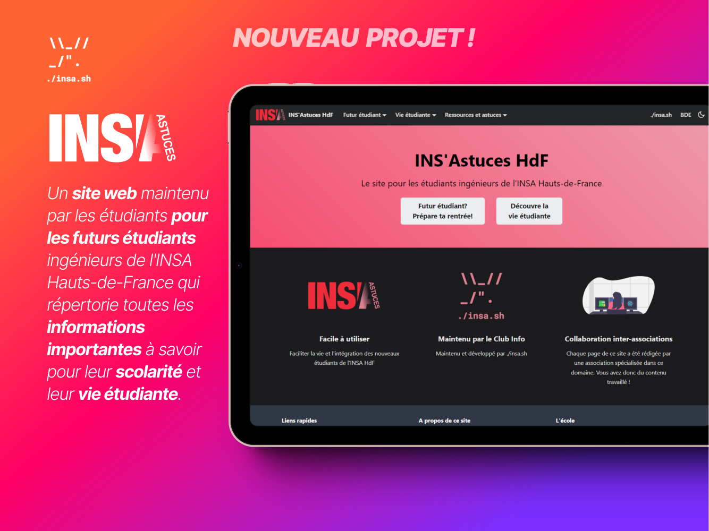
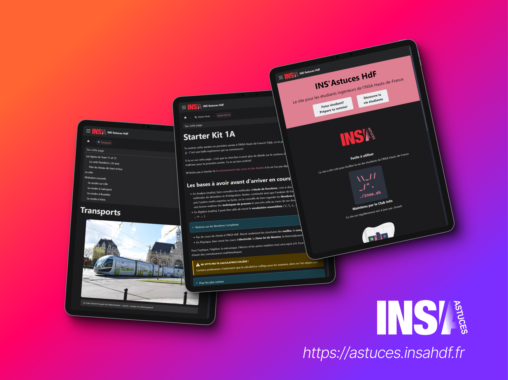
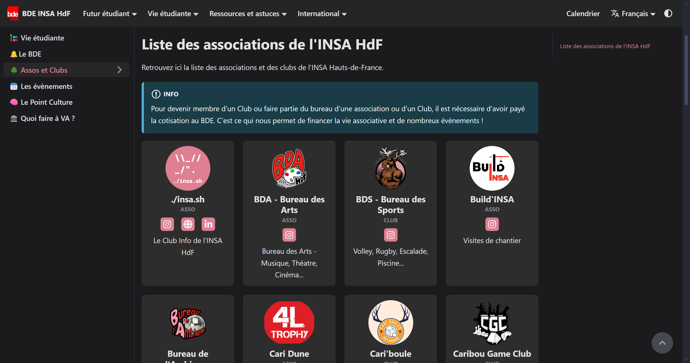
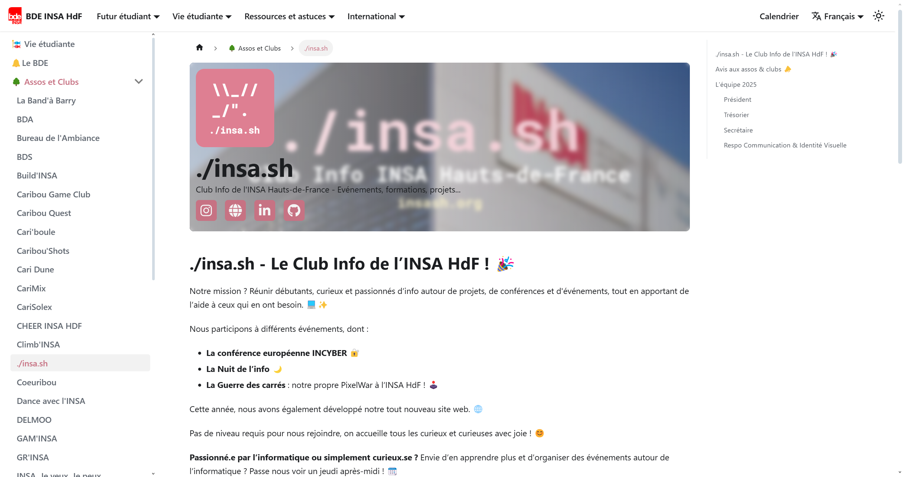

 

# Lancement du projet INS'Astuces

_L'objectif est de créer un site web simple maintenu **par les étudiants pour les étudiants** ingénieurs de l'INSA Hauts-de-France qui répertoriera toutes les informations importantes à savoir pour la **scolarité** et la **vie étudiante**._

# Accéder au site en pré-version

- Clique sur ce lien suivant pour dévérouiller le site : [unlock.insahdf.fr](https://insahdf.fr/verysecretearlyaccess.php)

 > ℹ️ **Note :** Le site est accessible en pré-version. Les liens d'accès sont susceptibles de changer dans les semaines à venir. 

# Contenu du site 

## Objectifs de contenu

- Un guide pour les futurs étudiants
    - [ ] Plan du campus et points repères
    - [ ] Transports
    - [ ] Logement
    - [ ] Admissions (redirection vers les liens officiels du Groupe INSA)
    - [ ] Starter Packs
        - [ ] 1A, 2A et 3A : comment bien démarrer l'année et appréhender les cours
        - [ ] Méthodes de travail
    - [ ] Discuter avec les étudiants actuels
- Vie étudiante
    - [ ] Le BDE, ça sert à quoi?
    - [ ] Liste des assos de l'INSA HdF (*voir ci-dessous*)
    - [ ] Les évènements annuels
- Conseils et tutos info
    - [ ] Les logiciels et services fournis par l'UPHF
    - [ ] Comment synchroniser ses mails avec une application mobile pour recevoir les notifs
    - [ ] Les meilleures réducs étudiantes sur les logiciels
- Administratif
    - [ ] Contacts utiles - responsables des SPE...
    - [ ] Fiches d'absences, syllabus...

> Toute suggestion de votre part est la bienvenue 🤝!

## Organisation de la création de pages
Toutes les pages en cours de création sont indiquées sur le Tableau de Bord du Projet : https://github.com/orgs/insa-sh/projects/1.

Si vous créez une page, assignez-vous la tâche et commencez à travailler !
## Une page personnalisable par association ou club
Chaque association possède sa propre page sur INS'Astuces. Vous pouvez **personnaliser la page de votre asso** en changeant le logo, l'image d'arrière-plan, la description ou encore les liens rapides. 

 

Vous pouvez aussi créer **une page complète pour présenter votre association**, vos activités, membres, évènements...
 

# Comment contribuer au projet
## Ce que vous pouvez faire
Vous pouvez participer à la réalisation du site INS'Astuces de différentes manières : 
- Créer le contenu des pages déjà proposées
- Proposer de nouvelles pages, fonctionnalités ou modifications pour le site
- Personnaliser la page de votre association
- Participer à la mise-en ligne et à la publication de contenus sur le site (passez nous voir au Club Info !)

## Comment créer le contenu d'une page

> Pensez à vérifier que personne ne travaille déjà sur la page 😉

 - Sélectionnez une page sur le Tableau de Bord du projet : https://github.com/orgs/insa-sh/projects/1
 - Ouvrez le dossier Google Drive partagé dédié à la création de pages : https://drive.google.com
 - **Créez un nouveau fichier** Google Doc (ou Word, md...) en réutilisant le modèle du fichier Google doc `02_modèle page vide`
 - Commencez à écrire !

> Une fois que vous avez fini, indiquez-le nous que nous puissions relire & publier la page !

[> Organisation du projet](https://github.com/orgs/insa-sh/projects/1)

[> Lien vers le dossier Google Drive](https://example.com/)

## Comment suggérer une fonctionnalité, un contenu ou signaler une erreur

Vous avez une idée de contenu à ajouter, une fonctionnalité à suggérer ou une erreur à signaler ? Ouvrez une issue sur ce dépôt en précisant votre demande.

[> Proposer une fonctionnalité, un contenu ou signaler une erreur](https://github.com/insa-sh/INSAstuces/issues/new)

## Personnaliser les pages des associations

### Ajouter une nouvelle Asso

- Rendez-vous sur le dossier Google Drive dédié aux pages des associations : https://drive.google.com
- Créez un dossier portant le nom de votre association
- Déposez-y toutes les informations demandées ci-dessous
- Une fois que tout est bon, faites nous signe pour que l'on publie votre nouvelle page d'association

Les responsables du projet INS'Astuces se chargeront de publier les modifications !

#### Informations à fournir** ( (\*) = obligatoire )
- Nom de l'association (\*)
- Logo (\*)
- Statut (club ou asso) (\*)
- Liens des réseaux à mettre en avant _(conseillé: 2 à 3 liens max)_
- Description courte _(<= 80 caractères espaces compris) à mettre sur la page [astuces.insahdf.fr/vie-etudiante/assos-et-clubs](https://astuces.insahdf.fr/vie-etudiante/assos-et-clubs)_
- Description plus détaillée _(<= 250 caractères espaces compris) à mettre sur la page dédiée à l'association_
- Cover de la page asso (note: l'image de fond est floutée)

    > **Logo**
    > - **Ratio:** Logo carré  
    > - **Résolution idéale:** 600px x 600px 
    > - **Formats acceptés:** favoriser .svg et .webp  (les autres formats seront convertis en .webp)  
    > - **Note:** Si votre logo a un fond transparent, assurez-vous qu'il soit bien lisible sur un fond noir et un fond blanc (que le logo soit bien adapté aux modes nuit et jour)

    >  **Exemples de liens pertinents**
    >- Site internet
    >- Instagram
    >- Lien d'invitation Discord
    >- LinkedIn
    >- Spotify/Deezer...

#### Aperçu de la présentation du site

### Ajouter du contenu à la page de mon asso
Chaque asso possède par défaut une page sur le site. Il est possible de **rajouter du contenu à cette page** pour mettre en avant vos activités, vous présenter. Ce site sera principalement consulté par les futurs étudiants, c'est ici que **vous pourrez séduire vos futures recrues**.

Le contenu de cette page sera écrit en `Markdown`. Vous ne savez pas ce que c'est ? Pas de soucis! **Publiez** ce que vous voulez y mettre **sur le Drive** dans un fichier Google Doc ou Word et on se chargera de le traduire dans le bon format.

### Modifier la page de mon asso

Pour modifier les informations - logo - photos - liens associés à votre asso, `rendez-vous sur le Google Drive dédié`. `Créez un dossier pour votre association` et uploadez les modifications à apporter. N'hésitez pas à joindre en pièce jointe les logos ou images que vous souhaitez modifier ou ajouter.

> **Note :** 
> Si votre demande de modification est particulière ou confidentielle, contactez-nous directement sur [Instagram](https://instagram.com/clubinfoinsahdf) ou par mail à [insa.sh.hdf@gmail.com](mailto:insa.sh.hdf@gmail.com).

# Développement

Plus d'informations sur : [Développement](https://github.com/insa-sh/INSAstuces/blob/main/INSAstuces/README.md)

> Inspirations : [WikiEtud INSA Toulouse](https://wiki.etud.insa-toulouse.fr/)

