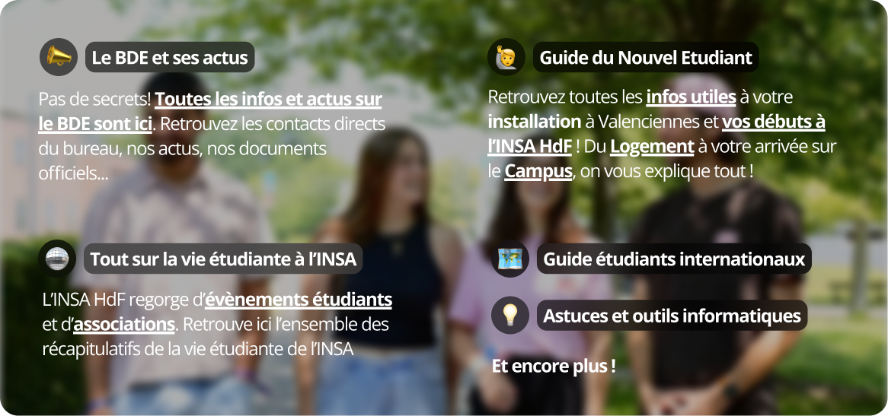

# BDE de l'INSA Hauts-de-France

> L'objectif est de créer un site web simple maintenu **par les étudiants pour les étudiants** ingénieurs de l'INSA Hauts-de-France qui répertorie toutes les informations importantes à savoir pour la **scolarité** et la **vie étudiante** et surtout qui soit un **guide pour l'arrivée des nouveaux étudiants** !.

<!--  -->

# Plan

- [BDE de l'INSA Hauts-de-France](#bde-de-linsa-hauts-de-france)
- [Plan](#plan)
- [Accès au site](#accès-au-site)
- [Contenu du site](#contenu-du-site)
  - [Contenus](#contenus)
  - [Organisation de la création de pages](#organisation-de-la-création-de-pages)
  - [Une page personnalisable par association ou club](#une-page-personnalisable-par-association-ou-club)
- [Contribuer au projet](#contribuer-au-projet)
  - [Comment suggérer une fonctionnalité, un contenu ou signaler une erreur](#comment-suggérer-une-fonctionnalité-un-contenu-ou-signaler-une-erreur)
  - [Personnaliser les pages A\&C](#personnaliser-les-pages-ac)
    - [Ajouter une nouvelle asso ou club](#ajouter-une-nouvelle-asso-ou-club)
      - [Informations à fournir ( \* = obligatoire )](#informations-à-fournir----obligatoire-)
      - [Aperçu de la présentation du site](#aperçu-de-la-présentation-du-site)
    - [Ajouter du contenu à la page de mon asso](#ajouter-du-contenu-à-la-page-de-mon-asso)
    - [Modifier la page de mon asso](#modifier-la-page-de-mon-asso)
- [Développement](#développement)

# Accès au site

- Le site est disponible en ligne à l'adresse suivante: [bde.insahdf.fr](https://bde.insahdf.fr)

<!--  -->

# Contenu du site

## Contenus

- Un guide pour les futurs étudiants
  - [x] Plan du campus et points repères
  - [x] Transports
  - [x] Logement
  - [x] Admissions (redirection vers les liens officiels du Groupe INSA)
  - [ ] Starter Packs
    - [ ] 1A, 2A et 3A : comment bien démarrer l'année et appréhender les cours
    - [x] Méthodes de travail
  - [x] Discuter avec les étudiants actuels
- Vie étudiante
  - [x] Le BDE, ça sert à quoi?
  - [x] Liste des assos de l'INSA HdF (_voir ci-dessous_)
  - [x] Les évènements annuels
- Conseils et tutos info
  - [x] Les logiciels et services fournis par l'UPHF
  - [x] Comment synchroniser ses mails avec une application mobile pour recevoir les notifs (x [./insa.sh](https://insash.org))
  - [x] Les meilleures réducs étudiantes sur les logiciels
- Administratif
  - [x] Contacts utiles - responsables des SPE...
- [ ] International
  - [x] Mobilité internationale
  - [x] ERASMUS / ECIU / Césure
  - [x] Section Internationale Globalinsa HdF
  - [ ] Accueil des étudiants internationaux

> Toute suggestion de votre part est la bienvenue 🤝!

## Organisation de la création de pages

Un tableau de bord de projet est ouvert pour organiser la création de contenu. : https://github.com/orgs/insa-sh/projects/1.

Les mises à jour sur le site se font sur la branche `dev` et doivent être vérifiées avant publication sur la branche `main`.

La modification du contenu peut se faire via le CMS **TinaCMS** qui travaille également sur la branche `dev`.

> **Ce site fonctionne grâce à vous !** Si vous voyez une information qui n'est pas à jour ou que vous pensez qu'il serait bon de rajouter des infos/ une page, n'hésitez pas à nous en faire part ! Vous pouvez le faire en ouvrant une issue sur ce dépôt ou en nous contactant directement ([Instagram BDE](https://instagram.com/bdeinsahdf), [mail BDI](mailto:bdi@insahdf.fr) ou [mail Club Info](mailto:contact@insash.org)...)

## Une page personnalisable par association ou club

Chaque association possède sa propre page sur le site du BDE. Vous pouvez **personnaliser la page de votre asso** en changeant le logo, l'image d'arrière-plan, la description ou encore les liens rapides.

Vous pouvez aussi créer **une page complète pour présenter votre association**, vos activités, membres, évènements...

# Contribuer au projet

## Comment suggérer une fonctionnalité, un contenu ou signaler une erreur

Vous avez une idée de contenu à ajouter, une fonctionnalité à suggérer ou une erreur à signaler ? Ouvrez une issue sur ce dépôt en précisant votre demande.

[> Proposer une fonctionnalité, un contenu ou signaler une erreur](https://github.com/BDE-INSA-Hauts-de-France/frontend/issues/new)

## Personnaliser les pages A&C

### Ajouter une nouvelle asso ou club

- Envoyez-nous toutes les informations demandées ci-dessous par mail

Les responsables du site se chargeront de publier les modifications !

#### Informations à fournir ( \* = obligatoire )

- Nom de l'association (\*)
- Logo (\*)
- Statut (club ou asso) (\*)
- Liens des réseaux à mettre en avant _(conseillé: 2 à 3 liens max)_
- Description courte _(<= 80 caractères espaces compris) à mettre sur la page [bde.insahdf.fr/vie-etudiante/assos-et-clubs](https://bde.insahdf.fr/vie-etudiante/assos-et-clubs)_
- Description plus détaillée _(<= 250 caractères espaces compris) à mettre sur la page dédiée à l'association_
- Cover de la page asso (note: l'image de fond est floutée)

  > **Logo**
  >
  > - **Ratio:** Logo carré  
  > - **Résolution idéale:** 600px x 600px 
  > - **Formats acceptés:** favoriser .svg et .webp (les autres formats seront convertis en .webp)  
  > - **Note:** Si votre logo a un fond transparent, assurez-vous qu'il soit bien lisible sur un fond noir et un fond blanc (que le logo soit bien adapté aux modes nuit et jour)

  > **Exemples de liens pertinents**
  >
  > - Site internet
  > - Instagram
  > - Lien d'invitation Discord
  > - LinkedIn
  > - Spotify/Deezer...

#### Aperçu de la présentation du site

### Ajouter du contenu à la page de mon asso

Chaque asso possède par défaut une page sur le site. Il est possible de **rajouter du contenu à cette page** pour mettre en avant vos activités, vous présenter. Ce site sera principalement consulté par les futurs étudiants, c'est ici que **vous pourrez séduire vos futures recrues**.

Le contenu de cette page sera écrit en `Markdown`. Vous ne savez pas ce que c'est ? Pas de soucis! **envoyez-nous** ce que vous voulez y mettre dans un fichier Google Doc ou Word et on se chargera de le traduire dans le bon format.

### Modifier la page de mon asso

Pour modifier les informations - logo - photos - liens associés à votre asso, c'est la même chose! Envoyez-nous les modifications à apporter. N'hésitez pas à joindre en pièce jointe les logos ou images que vous souhaitez modifier ou ajouter.

Vous pouvez aussi faire créer une issue diretement sur ce repo pour nous donner les modifs à effectuer.

> **Note :** 
> Si votre demande de modification est particulière ou confidentielle, contactez-nous directement sur [Instagram](https://instagram.com/clubinfoinsahdf) ou par mail à [insa.sh.hdf@gmail.com](mailto:insa.sh.hdf@gmail.com).

# Développement

Plus d'informations sur : [Développement](https://github.com/BDE-INSA-Hauts-de-France/frontend/blob/main/development.md)

---

## License

Ce projet est sous licence MIT. Voir le fichier [LICENSE](LICENSE) pour plus de détails.

> Inspirations :
>
> - [WikiEtud INSA Toulouse](https://wiki.etud.insa-toulouse.fr/)
> - [Club Info INSA HdF](https://insash.org/)
> - [Site de l'INSA HdF](https://www.insa-hdf.fr/)
