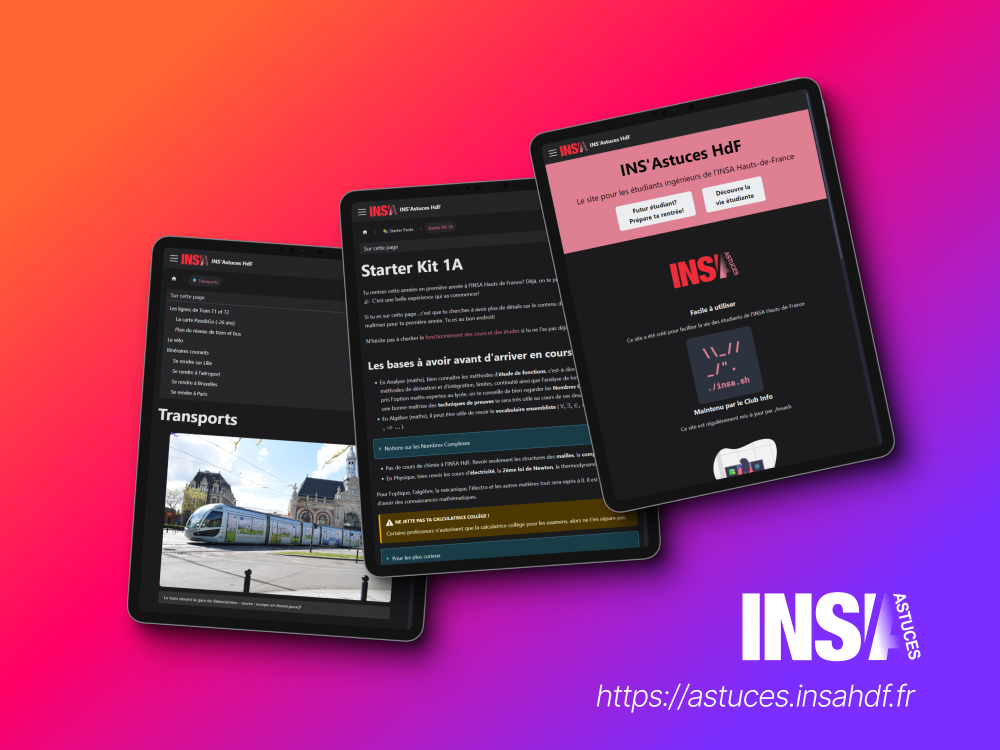
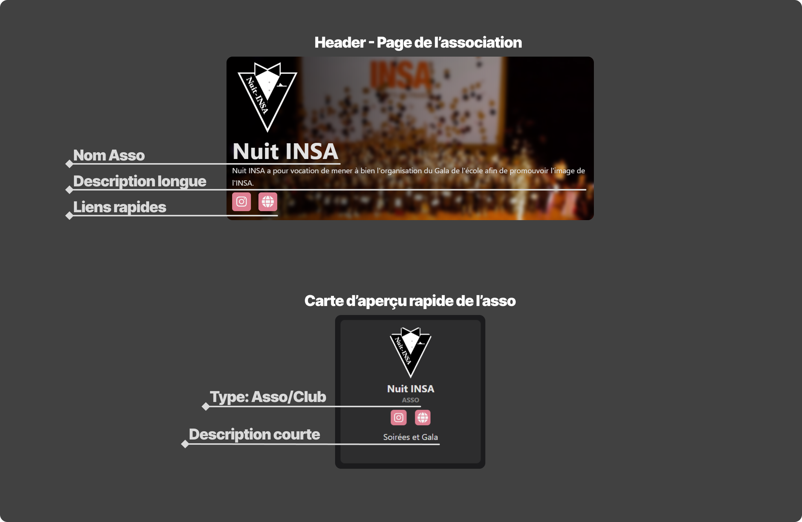

 

# INS'Astuces HdF 
_L'objectif est de créer un site web simple maintenu par les étudiants pour les étudiants ingénieurs de l'INSA Hauts-de-France qui répertoriera toutes les informations importantes à savoir pour la scolarité et la vie étudiante._

 

> **Note :** 
> Le site n'est accessible qu'en pré-version pour le moment.

 

## Contenu du site

Les premiers contenus de ce site seront:
- Un guide pour les futurs étudiants
    - Plan du campus et points repères
    - Transports
    - Logement
    - Admissions (redirection vers les liens officiels du Groupe INSA)
    - Starter Packs
        - 1A, 2A et 3A : comment bien démarrer l'année et appréhender les cours
        - Méthodes de travail
    - Discuter avec les étudiants actuels
- Vie étudiante
    - Le BDE, ça sert à quoi?
    - Liste des assos de l'INSA HdF
    - Les évènements annuels
- Conseils et tutos info
    - Les logiciels et services fournis par l'UPHF
    - Comment synchroniser ses mails avec une application mobile pour recevoir les notifs
    - Les meilleures réducs étudiantes sur les logiciels
- Administratif
    - Contacts utiles - responsables des SPE...
    - Fiches d'absences, syllabus...

 

# Accéder au site en pré-version

- Clique sur ce lien suivant pour dévérouiller le site : [unlock.insahdf.fr](https://unlock.insahdf.fr/)

# Les pages des associations
Chaque association possède sa propre page sur INS'Astuces. Vous pouvez **personnaliser la page de votre asso** en changeant le logo, l'image d'arrière-plan, la description ou encore les liens affichés... 

Vous pouvez aussi créer **une page complète pour présenter votre association**, vos activités, membres, évènements...

# Contribuer au projet

Vous pouvez participer au projet de différentes manières :

- Créer le contenu des pages déjà proposées (voir ci-dessous)
- Proposer de nouvelles pages pour le site
- Personnaliser la page de votre association ou club
- Proposer des améliorations pour le site
- Passer nous voir au Club Info pour discuter du développement et de la gestion du projet

## Modifier la page de mon asso

Pour modifier les informations - logo - photos - liens associés à votre asso, `rendez-vous sur le Google Drive dédié`. `Créez un dossier pour votre association` et uploadez les modifications à apporter. N'hésitez pas à joindre en pièce jointe les logos ou images que vous souhaitez modifier ou ajouter.

[> Demander un accès au dossier Google Drive](https://example.com)

> **Note :** 
> Si votre demande de modification est particulière ou confidentielle, contactez-nous directement sur Instagram ou par mail à [insa.sh.hdf@gmail.com](mailto:insa.sh.hdf@gmail.com).

## Ajouter une nouvelle Asso
Pour ajouter une association, c'est la même procédure! Accédez au dossier Google Drive et `ajoutez-y les informations indiquées ci-dessous` et les images à joindre. Les responsables du projet INS'Astuces se chargeront de publier les modifications !

[> Demander un accès au dossier Google Drive](https://example.com)

**Informations à fournir**
- Nom de l'association
- Logo
- Statut (club ou asso)
- Liens des réseaux à mettre en avant _(conseillé: 2 à 3 liens max)_
- Description courte _(<= 80 caractères espaces compris) à mettre sur la page [astuces.insahdf.fr/vie-etudiante/assos-et-clubs](https://astuces.insahdf.fr/vie-etudiante/assos-et-clubs)_
- Description plus détaillée _(<= 250 caractères espaces compris) à mettre sur la page dédiée à l'association_
- Cover de la page asso (note: l'image de fond est floutée)

    > **Logo**
    > - **Ratio:** Logo carré  
    > - **Résolution idéale:** 600px x 600px 
    > - **Formats acceptés:** favoriser .svg et .webp  (les autres formats seront convertis en .webp)  
    > - **Note:** Si votre logo a un fond transparent, assurez-vous qu'il soit bien lisible sur un fond noir et un fond blanc (que le logo soit bien adapté aux modes nuit et jour)

    >  **Exemples de liens pertinents**
    >- Site internet
    >- Instagram
    >- Lien d'invitation Discord
    >- LinkedIn
    >- Spotify/Deezer...

### Exemple des aperçus

### Ajouter du contenu à la page de mon asso
Chaque asso possède par défaut une page avec une bannière. Il est possible de rajouter du contenu à cette page pour mettre en avant vos activités, vous présenter. Ce site sera principalement consulté par les futurs étudiants, c'est ici que vous pourrez séduire vos futures recrues.

Le contenu de cette page sera écrit en `Markdown`. Vous ne savez pas ce que c'est ? Pas de soucis! Publiez ce que vous voulez y mettre sur le Drive dans un fichier Google Doc ou Word et on se chargera de le traduire dans le bon format.

<!-- # Aperçus des pages -->

<!--  -->

<!--  -->

## Créer le contenu d'une page
Voici le planning du projet avec les tâches à réaliser : https://github.com/orgs/insa-sh/projects/1. Certaines tâches sont réservées à des associations mais si vous avez des idées de contenu à ajouter, n'hésitez pas à nous en faire part. Vous voulez créer une page ? Indiquez que vous travaillez sur une tache et publiez votre contenu sur le Drive dans un fichier Google Doc en suivant le modèle proposé (1ers fichiers du dossier)

> Attention à bien vérifier que les pages que vous choisissez ne sont pas déjà réservées à des associations ! Tout est précisé sur le Drive.

[> Planning du projet](https://github.com/orgs/insa-sh/projects/1)

[> Lien vers le dossier Google Drive](https://example.com)

# Suggérer une fonctionnalité, un contenu ou signaler une erreur

Vous avez une idée de contenu à ajouter, une fonctionnalité à suggérer ou une erreur à signaler ? Ouvrez une issue sur ce dépôt en précisant votre demande.

[> Proposer une fonctionalité, un contenu ou signaler une erreur](https://github.com/insa-sh/INSAstuces/issues/new)

# Rejoindre le projet

Tu veux faire partie du projet ? Passe nous voir au Club info ou rejoins notre Discord pour en discuter !

# Développement
Plus d'informations sur : [Développement](INSAstuces/README.md)

> Inspirations : [WikiEtud INSA Toulouse](https://wiki.etud.insa-toulouse.fr/)